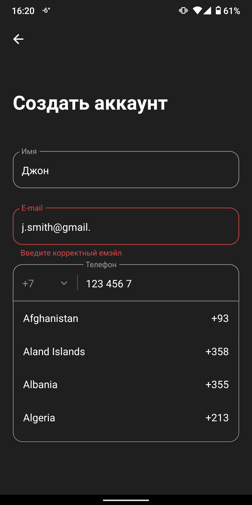

Sign up form written as a test task for a position of react native developer

## Screenshots

<div>
  
  
  
</div>

## What's used

- React Native
- React Native Paper - most of the UI components
- RNUILib - custom checkbox
- Formik - form
- Yup - form validation schema
- Firebase - database

## Installing

To build the apk clone this repo then:

```shell
npm install
cd android
./gradlew assembleRelease
```
